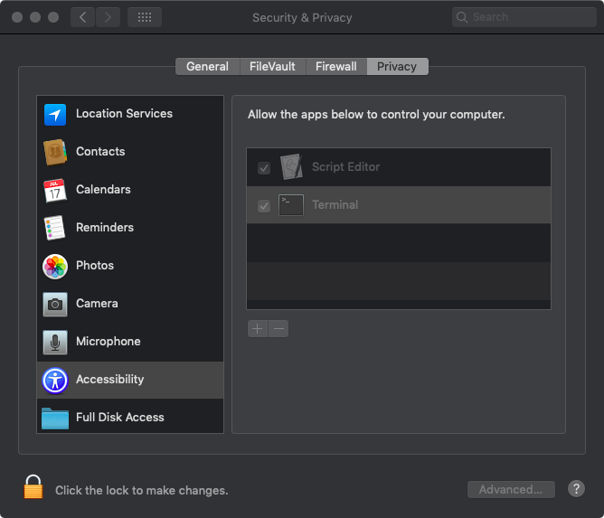

# onetenth

[demo](https://msliczniak.github.io/octo/onetenth/onetenth.htm)

in inspector add attribude:

style="position:absolute; top:50px; right:250px;"

to add implicit sources:

$ make onetenth.deps && git add `./ideps.sh onetenth | sed 's/$/4/'`

rebuild everything with breakpoints:

$ make MPFLAGS=-D_DEBUG clean \
  test300.hex onetenth-eti.ch8 onetenth.hex cb && \
  ls -l onetenth.ch8 | awk '{ print 2960 - $(NF - 4); exit }'

rebuild for two page 8X

$ make clean onetenth.c8x && \
  xxd -l2470 -c1 -a onetenth.c8x | tail -3 | \
  awk -F: '{ print "ibase=16"; print "CA6 -", toupper($1); exit }' | bc

record screen:

open and then position in the lower right corner of screen 0
$ open black.png

$ system_profiler SPDisplaysDataType | grep -iw resolution:
          Resolution: 1440 x 900 (Widescreen eXtended Graphics Array Plus)

Start program in Emma 02 so it is the front window.

Enable Access for assistive devices to run this script:

$ open -a applescript\ editor
> tell application "System Events" to tell process "Emma 02" to get the position of the front window
$ osascript -e 'tell application "System Events" to tell process "Emma 02" to set the position of the front window to {1032, 606}'

Which device is screen 0:

$ ffmpeg -hide_banner -f avfoundation -list_devices true -i '' 2>&1 | awk '$NF == 0 && tolower($(NF-1)) == "screen" && tolower($(NF-2)) == "capture" { print $(NF-3) }'
[1]

H.265
$ ffmpeg -pix_fmt bgr0 -r 60 -hide_banner -f avfoundation -i 1:0 -pix_fmt gbrp -dst_range 1 -color_range 2 -vf 'crop=384:256:1056:644' -y -an -c:v libx265 -x265-params lossless=1:range=full -s 384x256 -sn -map_metadata -1 out.mp4
$ open -a vlc out.mp4

H.264
$ ffmpeg -hide_banner -i out.mp4 -an -sn -map_metadata -1 -pix_fmt yuv420p -dst_range 1 -color_range 2 -c:v libx264 -b:v 56k -pass 1 -f m4v -y -movflags faststart /dev/null
$ ffmpeg -hide_banner -i out.mp4 -an -sn -map_metadata -1 -pix_fmt yuv420p -dst_range 1 -color_range 2 -c:v libx264 -b:v 56k -pass 2 -y -movflags faststart out.m4v
$ rm -f ffmpeg2pass-0.log ffmpeg2pass-0.log.mbtree
